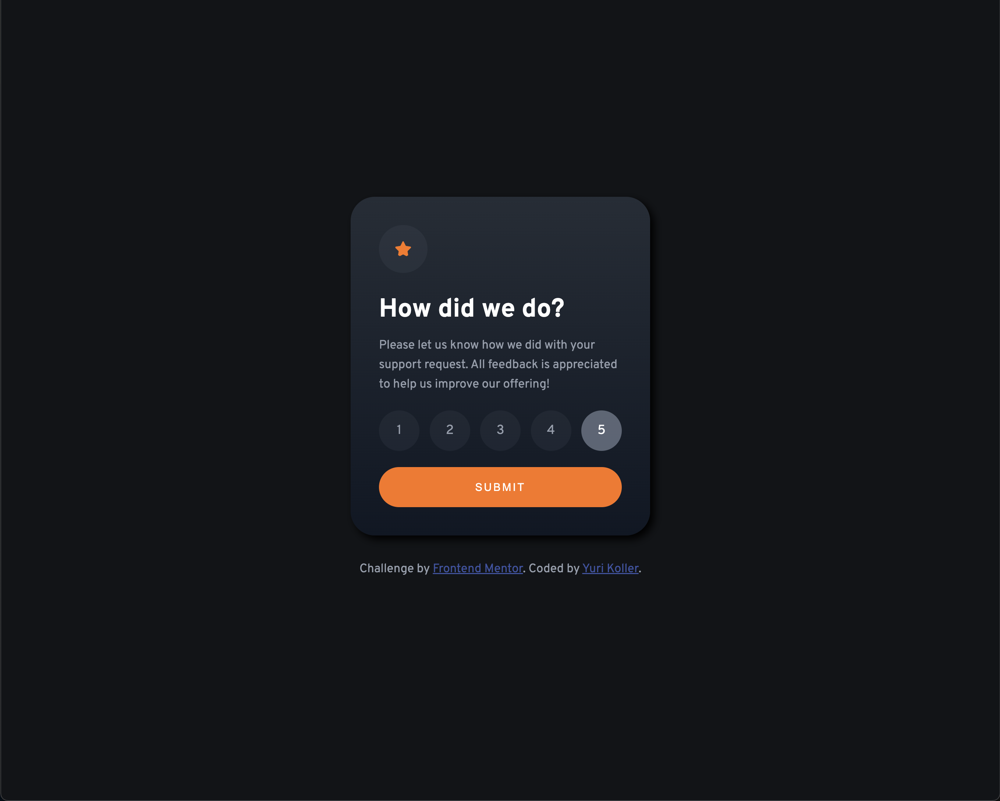

# Frontend Mentor - Interactive rating component solution

This is my solution to the [Interactive rating component challenge on Frontend Mentor](https://www.frontendmentor.io/challenges/interactive-rating-component-koxpeBUmI). Frontend Mentor challenges help you improve your coding skills by building realistic projects.

## Table of contents

- [Overview](#overview)
  - [The challenge](#the-challenge)
  - [Screenshot](#screenshot)
  - [Links](#links)
- [My process](#my-process)
  - [Built with](#built-with)
  - [What I learned](#what-i-learned)
  - [Continued development](#continued-development)
  - [Useful resources](#useful-resources)
- [Author](#author)

## Overview

### The challenge

Users should be able to:

- View the optimal layout for the app depending on their device's screen size
- See active states for all interactive elements on the page
- Select and submit a number rating
- See the "Thank you" card state after submitting a rating

### Screenshot



### Links

- Solution URL: [github solution](https://github.com/rnsnceman/Interactive-Rating-Component.git)
- Live Site URL: [live site](https://rnsnceman.github.io/Interactive-Rating-Component/)

## My process

### Built with

- Semantic HTML5 markup
- CSS custom properties
- Flexbox
- Mobile-first workflow
- Vanilla Javascript

### What I learned

Being that I'm still learning, I wasn't aware of how I could make a radio input look like a button. Thankfully, I was able to get some ideas from youtube and stackoverflow.

Here is my solution:

```css
input[type="radio"] {
  position: relative;
  left: 30px;
  display: none;
}

label {
  color: hsl(217, 12%, 63%);
  display: flex;
  justify-content: center;
  align-items: center;
  width: 50px;
  height: 50px;
  border-radius: 50px;
  background-color: hsla(216, 12%, 54%, 0.088);
}

label:hover {
    background-color: hsl(25, 97%, 53%);
    color: white;
    transition: 0.5s;
}

input:checked + label {
  background-color: hsla(216, 12%, 54%, 0.686);
  color: white;
}
```

### Continued development

I look forward to expanding my knowledge in javascript functionality which I believe is my weakest skill in coding at the moment.

### Useful resources

- [StackOverflow](https://www.stackoverflow.com) - This helped me when I was trying to figure out how to to display the rating that was submitted in the span element.

## Author

- Frontend Mentor - [@rnsnceman](https://www.frontendmentor.io/profile/rnsnceman)
- Instagram - [@yurikoller](https://www.instagram.com/yurikoller)
